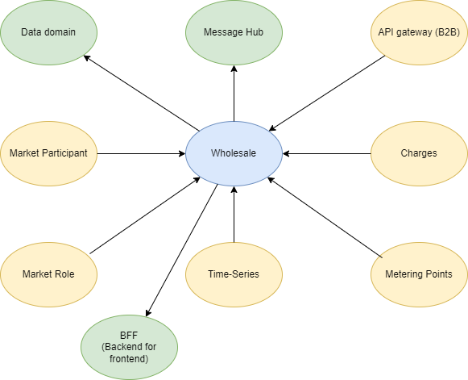

# Wholesale

## Table of content

* [Introduction](#introduction)
* [Context Map](#context-map)
* [Getting started](#getting-started)
* [Test](#test)

## Introduction

The wholesale domain is in charge of doing calculations on the time series sent to Green Energy Hub and executing the balance and wholesale settlement process.

The main calculations the domain is responsible to process are consumption, production, exchange between grid areas and the current grid loss within a grid area.  
All calculations return a result for grid area, balance responsible parties and energy suppliers.

The times series sent to Green Energy Hub is processed and enriched in the [Time Series domain](https://github.com/Energinet-DataHub/geh-timeseries) before they can be picked up by the Aggregations domain.

The calculated results are packaged and forwarded to the legitimate market participants:

| Market Participants |
| ----------- |
| Grid Access Provider  |
| Balance Responsible Party |
| Energy Supplier |
| eSett |

These are the business processes maintained by this domain:

| Processes |
| ----------- |
| [Submission of calculated energy time series](docs/business-processes/submission-of-calculated-energy-time-series.md) |
| [Request for calculated energy time series](docs/business-processes/request-for-calculated-energy-time-series.md) |
| [Aggregation of wholesale services](docs/business-processes/aggregation-of-wholesale-services.md) |
| [Request for aggregated subscriptions or fees](docs/business-processes/request-for-aggregated-subscriptions-or-fees.md) |
| [Request for aggregated tariffs](docs/business-processes/request-for-aggregated-tariffs.md) |
| [Request for settlement basis](docs/business-processes/request-for-settlement-basis.md) |

## Context Map

## Getting started

This section will be updated as we go when adding code and functionality to the domain.

## Test

Read about general QA that applies to the entire Green Energy Hub [here](https://github.com/Energinet-DataHub/green-energy-hub/blob/main/docs/quality-assurance-and-test.md).
