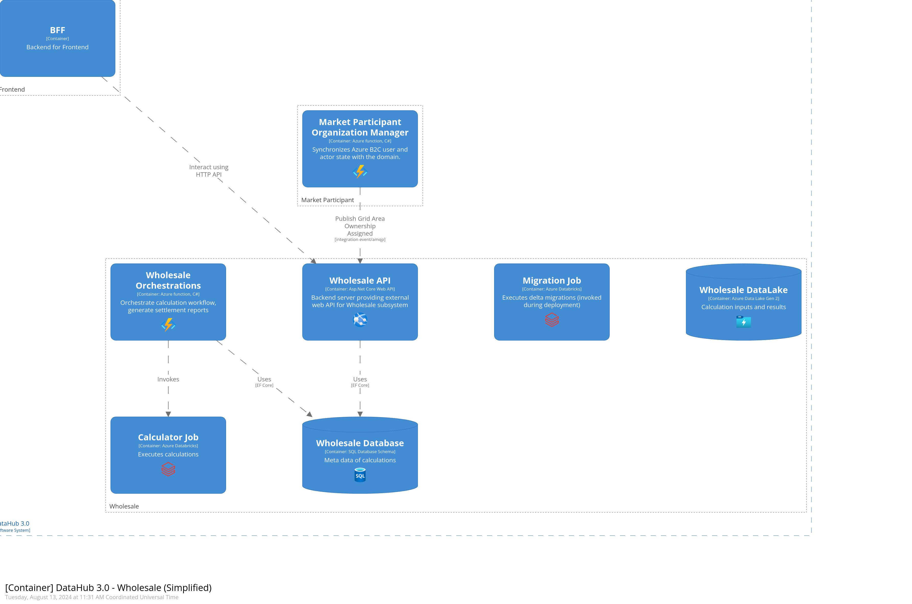
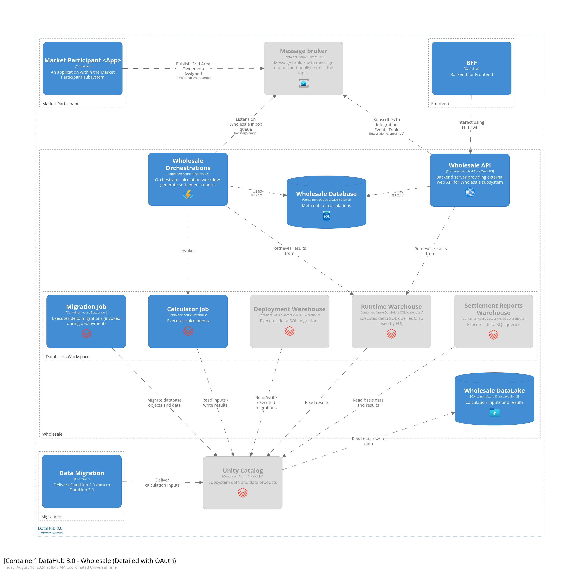

# Wholesale

* [Getting Started for Developers](#getting-started-for-developers)
* [Code of Conduct](#code-of-conduct)
* [Where can I get more help?](#where-can-i-get-more-help)

## Getting Started for Developers

The source code of the repository is provided as-is. We currently do not accept contributions or forks from outside the project driving the current development.

For people on the project please read the internal documentation (Confluence) for details on how to contribute or integrate with the domain.

## C4 Diagrams of the Domain

## Code of Conduct

Learn about code of conduct for Green Energy Hub [here](https://github.com/Energinet-DataHub/green-energy-hub/blob/main/docs/code-of-conduct.md).

## Where can I get more help?

Read about community for Green Energy Hub [here](https://github.com/Energinet-DataHub/green-energy-hub/blob/main/COMMUNITY.md) and learn about how to get involved and get help.

Please note that we have provided a [Dictionary](https://github.com/Energinet-DataHub/green-energy-hub/tree/main/docs/dictionary-and-concepts) to help understand many of the terms used throughout the repository.

## Thanks to all the people who already contributed

## Testing integration to Azure DevOps

1. Created and pushed branch.
2. Commit change with a code in the commit message.
