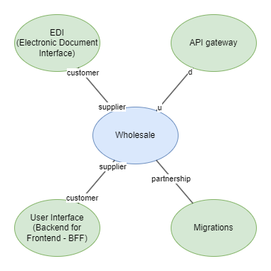
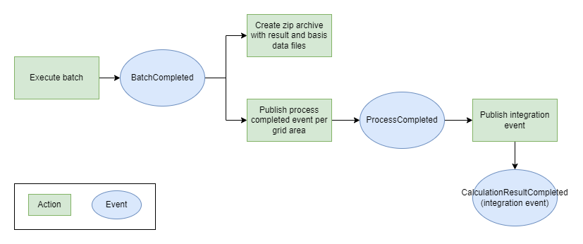

# Wholesale

## Table of content

* [Wholesale](#wholesale)
    * [Table of content](#table-of-content)
    * [Introduction](#introduction)
    * [Getting started](#getting-started)
    * [Understanding the Domain](#understanding-the-domain)
    * [Databricks](#databricks)
    * [Test](#test)
    * [Where can I get more help?](#where-can-i-get-more-help)
    * [Integrating](#integrating)

## Introduction

The wholesale domain is in charge of doing calculations on the time series sent to DataHub and executing the balance and wholesale settlement process.

The main calculations the domain is responsible to process are consumption, production, exchange between grid areas and the current grid loss within a grid area.  
All calculations return a result for grid area, balance responsible parties and energy suppliers.

The times series sent to DataHub is processed and prepared for calculations in the (private) migration domain.

The calculated results are packaged and forwarded to the legitimate market participants:

| Market Participants |
| ----------- |
| Grid Access Provider  |
| Balance Responsible Party |
| Energy Supplier |
| eSett |

These are the business processes maintained by this domain:

| Processes |
| ------------ |
| [Submission of calculated energy time series](docs/business-processes/submission-of-calculated-energy-time-series.md) |
| [Request for calculated energy time series](docs/business-processes/request-for-calculated-energy-time-series.md) |
| [Aggregation of wholesale services](docs/business-processes/aggregation-of-wholesale-services.md) |
| [Request for aggregated subscriptions or fees](docs/business-processes/request-for-aggregated-subscriptions-or-fees.md) |
| [Request for aggregated tariffs](docs/business-processes/request-for-aggregated-tariffs.md) |
| [Request for settlement basis](docs/business-processes/request-for-settlement-basis.md) |

## Getting started

This section will be updated as we go when adding code and functionality to the domain.

## Understanding the Domain

This is the context map.

Read about the architecture [here](docs/architecture.md).

Event flows in the domain.

Learn about the wholesale ubiquitous language [here](docs/ubiquitous-language.md).

## Databricks

[Databricks readme](source/databricks#readme)

## Test

In team Mandolorian we have agreed on a test strategy which is located [here](docs/test-strategy.md)

When writing unit tests we strive to write the test method names the following way: `MemberName_WhenSomething_IsOrDoes`. Where member name is usually a method name but can also be a property name. The "WhenSomething" part can be left out in cases where it doesn't add any meaningful value. "IsOrDoes" represents the expected behavior like "returning", "throwing" or a side-effect.
an example can be found [here](source/dotnet/wholesale-api/WebApi.UnitTests/Domain/BatchAggregate/BatchTests.cs)

Read about general QA that applies to the entire Green Energy Hub [here](https://github.com/Energinet-DataHub/green-energy-hub/blob/main/docs/quality-assurance-and-test.md).

## Where can I get more help?

Read about community for Green Energy Hub [here](https://github.com/Energinet-DataHub/green-energy-hub/blob/main/COMMUNITY.md) and learn about how to get involved and get help.

Please note that we have provided a [Dictionary](https://github.com/Energinet-DataHub/green-energy-hub/tree/main/docs/dictionary-and-concepts) to help understand many of the terms used throughout the repository.

## Integrating

### Integration Events

The wholesale domain publishes an integration event when a process has completed. The events contains the data defined by the
[`calculation_result_completed.proto`](source/dotnet/Contracts/calculation_result_completed.proto) Google Protocol Buffers contract.

The process type is specified in the message type meta data of the transport messages according to `ADR-008`.

The set of supported process types can be found in [`calculation_result_completed.proto`](source/dotnet/Contracts/CalculationResultCompleted.cs).

### Web API

Process results can be fetched using [the wholesale web API](source/dotnet/wholesale-api/).

### Calculation Input Contracts

Read about the contracts [here](docs/inter-domain-integration/README.md).
