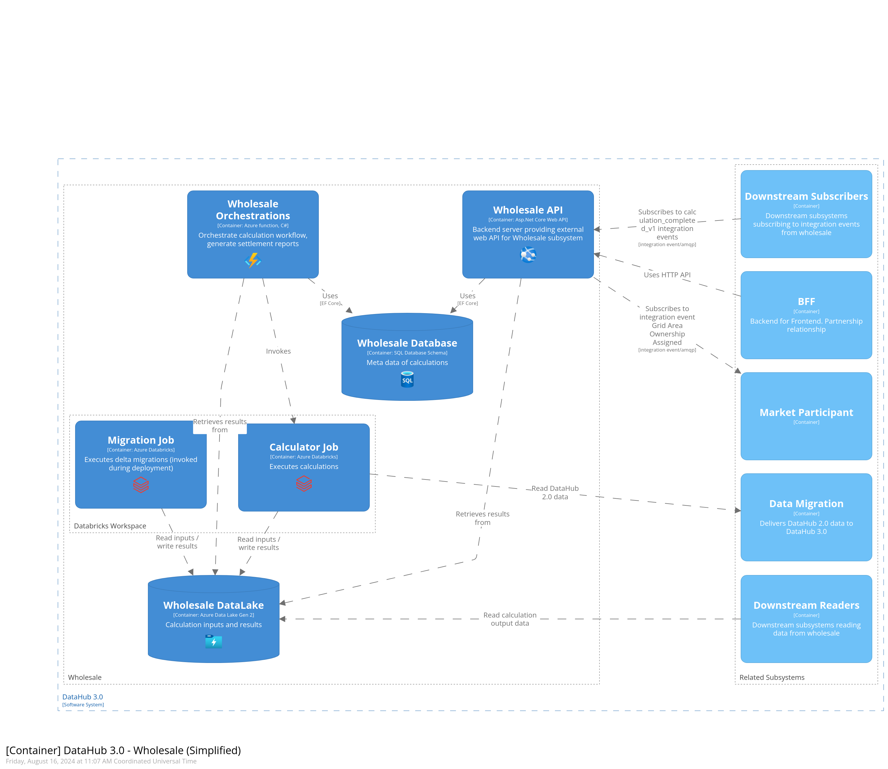
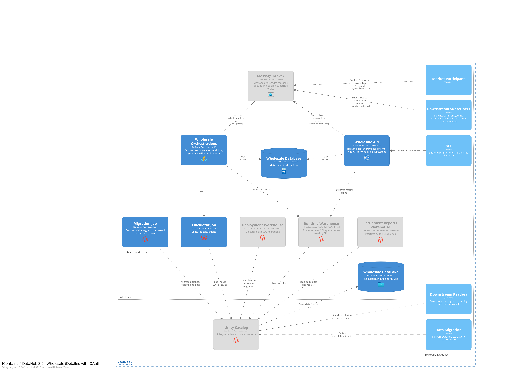

# Wholesale

* [Getting Started for Developers](#getting-started-for-developers)
* [Code of Conduct](#code-of-conduct)
* [Where can I get more help?](#where-can-i-get-more-help)

## Getting Started for Developers

The source code of the repository is provided as-is. We currently do not accept contributions or forks from outside the project driving the current development.

For people on the project please read the internal documentation (Confluence) for details on how to contribute or integrate with the subsystem

## C4 Diagrams of the Subsystem

## Thanks to all the people who already contributed

