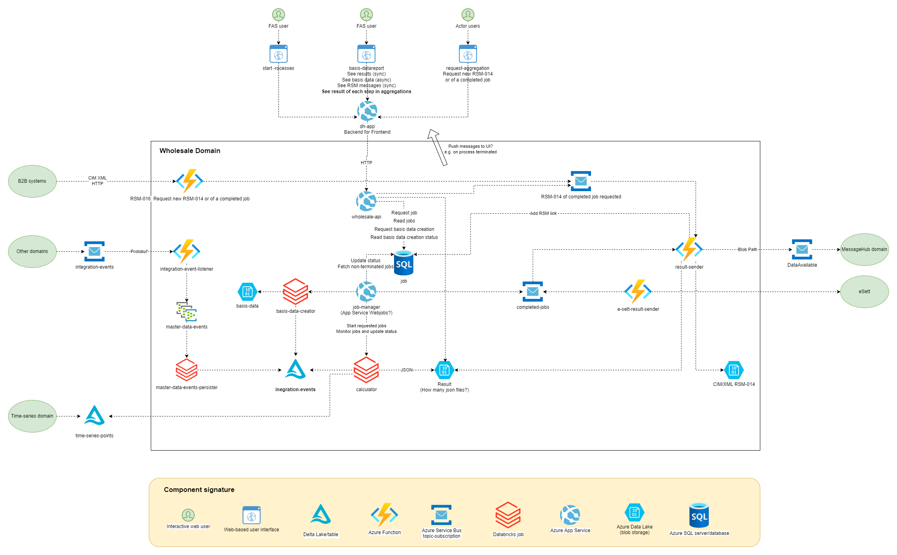

# Architecture

## Design Drivers

In general DataHub is build as a .NET Azure cloud based b2b system.
The wholesale domain, however, crunches huge amounts of data and so the decision has been made to base those crunching parts on the [Databricks Lakehouse Platform](https://databricks.com/).

Data stored in parquet (possibly in Delta Tables) cannot be read synchronously.
This implies an impedance mismatch between the requirements of the use cases of the interactive web-based users and the inner workings of the domain.
This is key to understand some of the architectural design decisions.

## How does it Look?

Direction of arrows between components designate (1) flow of data like messages and/or (2) invocation in which case the arrow origins at the caller and points to the callee.

Systems, domains, and users interacting with the domain are colored green to easily identify the origin of the interactions with the domain.

## Selected Components

### `time-series-points`

Supports retrieval of historical state of metering points.
This is a bi-temporal requirement that the data source must also be able to retrieve
the state of time series points as they were at a certain point in time.

### `integration-event-listener`

Subscribes to integration events of interest from other domains, extracts the content from the Protobuf encoded messages.
The purpose is the Protobuf decoding, which happens to be much simpler to do in .NET rather than in python.

### `job-manager`

Manages requested jobs.

Non-terminated jobs registered in the SQL database are monitored.
Requested jobs are being started as Databricks jobs in the `calculator`.
The manager continously monitors the Databricks jobs in order to (1) update the job status in the SQL table and
(2) publish job completed events to `completed-jobs`.

Details: The manager provides the output path of the results to the `calculator` and adds the path to job in the SQL table.

### `result-sender`

Sends result to actors when aggregation job is complete.

As per integration design by the MessageHub domain the sender creates the necessary CIM XML RSM-014 documents
and sends the path to the DataAvailable component of the MessageHub domain.
This in turn enables the actors to peek and dequeue the messages.

### `e-sett-result-sender`

Subscribes to job completed events and sends results to [eSett](https://www.esett.com/) for nordic imbalance settlement.

## Selected Use Cases

The following use cases are important yet hard to follow in the architecture diagram.

### Execute an aggregation job

A FAS user requests an aggregation job on the start processes web page.
The request is forwarded by the `dh-app` to the `wholesale-api`,
which in turn stores the job in the SQL table with a "requested" state.
The `job-manager` monitors the SQL table and sees the job and invokes a new Databricks `calculator` job to execute the job.
The `job-manager` monitors the Databricks job and upon termination (failure or success) the job status
in the SQL table is updated and a completed event is published in case the job succeeded.

### View basis data in web

A FAS user can see basis data of an aggregation job by sending a request to generate the basis data.
This is done on the basis data report page. This request is forwarded by `dh-app` to `wholesale-api`,
which adds the request to the SQL database.
`job-manager` monitors the table and invokes a `basis-data-creator` job that creates the basis data in a format that can be read synchronously.
When the job completes the `job-manager` notifies the interactive user probably by means of
(some yet to be designed and implemented) push notification system. The user can now from this notification access the basis data.

## Future Considerations

### Synchronous Access to Basis Data

Interactive user needs to request basis data before they can access them.
It is desirable to not keep copies of the massive amounts of basis data so it is not desirable to create - and keep -
synchronously accessible copies of these data.
Use cases suggest that basis data are almost always accessed the first few days after job execution.
Thus a solution could be to create kind of a cache where basis data copies are always created
but are cleaned up as defined by a retention policy.
This provides for a nice user experience without the cost of long term copies.
The cache will have fallback to the current behaviour with the request-create pattern of accessing basis data.
