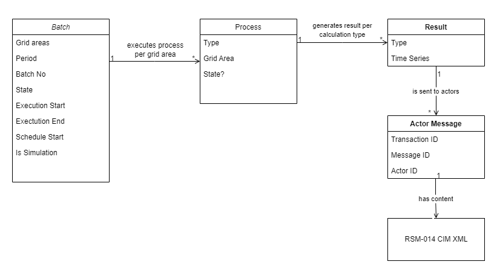

# Process Terms

The drawing shows most of the terms and conceptual models relating to aggregation processes in the wholesale domain.

The following expressions exemplify the domain langauge.

- When a user selects to **start a process** (in the client) a **batch** is created
- The batch executes all the **processes** of the selected **process type**
- A process type can be e.g. a **balance fixing**, a **wholesale fixing** and more
- A process of a given type can also be referred to simply by the name of it's type. An example is that a "process with type balance fixing" is equivalent to a "balance fixing".
- A batch is executed as a single calculation unit but also includes sending of **messages** to the actors
- A batch can be **scheduled** in which case its execution will be deferred to the selected date/time
- The output of a process is a set of **results** for each **calculation type**
- A calculation type can be **total production**, **total consumption** and more
- Each result is sent as a message to one or more actors
- The **message content** is an RSM-014 CIM XML document
- A batch can be **cancelled** in which case any running process will be stopped
