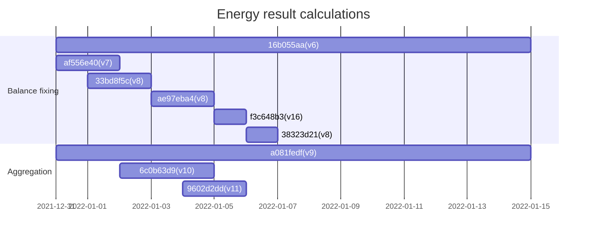
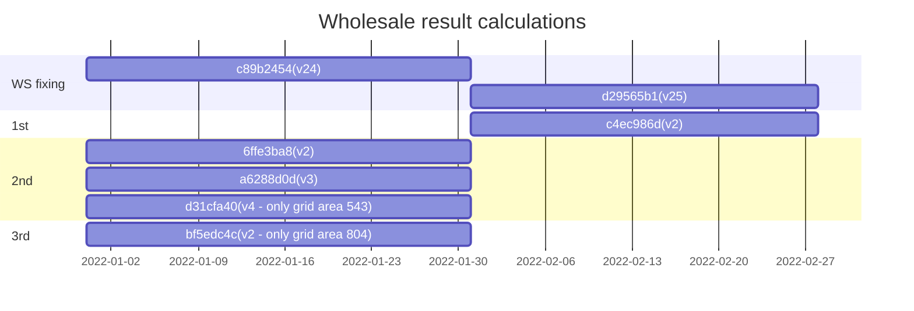

# CSV data for integration tests

## Basis data

The calculations are derived from the following basis data:

```sql
select *
from basis_data.calculations
where period_start between '2021-12-31T23:00:00.000' and '2022-01-31T23:00:00.000'
order by period_start, execution_time_start
```

Do note that the aggregation `9602d2dd-e704-48f7-9112-ab3e06ff4527` has been changed to version 11. This is due to bug
`#393`, where two calculations ended up with the same version.

The calculations can be visually represented with the following charts:





## Energy results

The data is limited to the period 2022-01-01 to 2022-01-15 due to size constraints on databricks requests.

```sql
select *
from wholesale_calculation_results.energy_per_es_brp_ga_v1
where (time between '2021-12-31T23:00:00Z' and '2022-01-15T23:00:00Z')
  and (
    (energy_supplier_id in ('5790002617263', '5790000701414', '5790001687137'))
        or (energy_supplier_id is null and balance_responsible_party_id in ('5790000701414','5790001964597'))
        or (energy_supplier_id is null and balance_responsible_party_id is null)
    )
  and grid_area_code in ('543','584','804')
  and calculation_type in ('balance_fixing', 'aggregation', 'second_correction_settlement', 'third_correction_settlement')
```

```sql
select *
from wholesale_calculation_results.energy_per_brp_ga_v1
where (time between '2021-12-31T23:00:00Z' and '2022-01-15T23:00:00Z')
  and (
    balance_responsible_party_id in ('5790000701414','5790001964597')
  )
  and grid_area_code in ('543','584','804')
  and calculation_type in ('balance_fixing', 'aggregation', 'second_correction_settlement', 'third_correction_settlement')
```

```sql
select *
from wholesale_calculation_results.energy_per_ga_v1
where (time between '2021-12-31T23:00:00Z' and '2022-01-15T23:00:00Z')
  and grid_area_code in ('543','584','804')
  and calculation_type in ('balance_fixing', 'aggregation', 'second_correction_settlement', 'third_correction_settlement')
```

The actors and grid areas are related as follows:

| Energy supplier | Balance responsibles         | Grid areas |
|-----------------|------------------------------|------------|
| 5790001687137   | 5790000701414                | 804, 543   |
| 5790000701414   | 5790000701414                | 543, 584   |
| 5790002617263   | 5790001964597, 5790000701414 | 804        |

## Wholesale results

The data constitutes the entirety of January 2022---limited to a subset of energy suppliers, balance responsibles, and
grid areas.

```sql
SELECT er.*
FROM (wholesale_output.wholesale_results er INNER JOIN basis_data.calculations cs
      ON er.calculation_id = cs.calculation_id)
WHERE (`time` BETWEEN '2021-12-31T23:00:00Z' AND '2022-01-31T22:00:00Z')
  AND energy_supplier_id IN ('5790001095390', '5790000701278', '5790001687137')
```

The actors and grid areas are related as follows:

| Energy supplier | Charge owners                                                             | Grid areas         |
|-----------------|---------------------------------------------------------------------------|--------------------|
| 5790001095390   | 5790000392551, 5790000610976, 5790000432752, 5790001089023                | 533, 543, 584      |
| 5790000701278   | 8100000000047, 5790001089023, 5790000392551, 5790000610976, 5790000432752 | 533, 543, 584, 804 |
| 5790001687137   | 5790000610976, 5790000432752, 8100000000047                               | 543, 804           |
